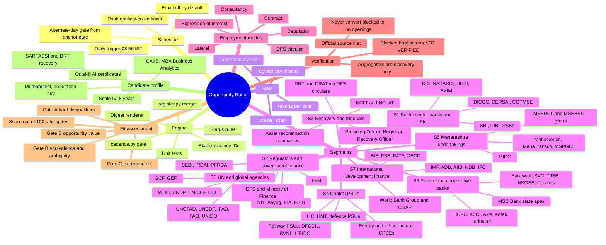

# Opportunity Radar: mind map

```mermaid
mindmap
  root((Opportunity Radar))
    Schedule
      Daily trigger 08:56 IST
      Alternate-day gate from anchor date
      Push notification on finish
      Email off by default
    Engine
      cadence.py gate
      register.py merge
      Stable vacancy IDs
      Status rules
      Digest renderer
      Unit tests
    State
      register.json history
      runs per scan
      reports per scan
      Commit to branch
    Segments
      S1 Public sector banks and FIs
        SBI, IDBI, PSBs
        RBI, NABARD, SIDBI, EXIM
        DICGC, CERSAI, CGTMSE
      S2 Regulators and government finance
        DFS and Ministry of Finance
        IBBI
        SEBI, IRDAI, PFRDA
        NITI Aayog, IBA, FSIB
      S3 Recovery and tribunals
        DRT and DRAT via DFS circulars
        Presiding Officer, Registrar, Recovery Officer
        NCLT and NCLAT
        Asset reconstruction companies
      S4 Central PSUs
        Railway PSUs, DFCCIL, RVNL, HRIDC
        Energy and infrastructure CPSEs
        LIC, HMT, defence PSUs
      S5 Maharashtra undertakings
        MSEDCL and MSEBHCL group
        MahaGenco, MahaTransco, MSPGCL
        MIDC
      S6 Private and cooperative banks
        HDFC, ICICI, Axis, Kotak, IndusInd
        Saraswat, SVC, TJSB, NKGSB, Cosmos
        MSC Bank state apex
      S7 International development finance
        World Bank Group and CGAP
        IMF, ADB, AIIB, NDB, IFC
        BIS, FSB, FATF, OECD
      S8 UN and global agencies
        WHO, UNDP, UNICEF, ILO
        UNCTAD, UNCDF, IFAD, FAO, UNIDO
        GCF, GEF
    Employment modes
      DFS circular
      Deputation
      Lateral
      Contract
      Consultancy
      Expression of interest
    Verification
      Official source first
      Aggregators are discovery only
      Blocked host means NOT VERIFIED
      Never convert blocked to no openings
    Fit assessment
      Gate A hard disqualifiers
      Gate B equivalence and ambiguity
      Gate C experience fit
      Gate D opportunity value
      Score out of 100 after gates
    Candidate profile
      Scale IV, 8 years
      CAIIB, MBA Business Analytics
      SARFAESI and DRT recovery
      Outskill AI certificates
      Mumbai first, deputation first
```
